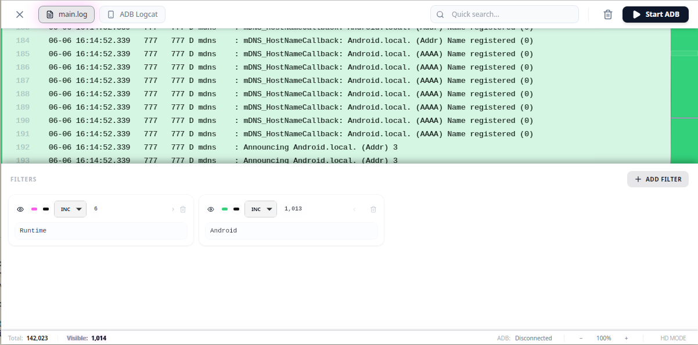

# 🌌 LogAnalysis

> **A high-performance, cross-platform log viewer and real-time monitoring tool**  
> Built with **Tauri** • **Rust** • **React**

[](assets/screenshot.png)

**LogAnalysis** is designed to handle multi-gigabyte log files and high-velocity ADB streams while maintaining a silky-smooth 60fps user interface. Experience blazing-fast log analysis with advanced filtering, real-time monitoring, and beautiful syntax highlighting.

---

## ✨ Key Features

- **⚡ Blazing Fast indexing:** Uses memory-mapped files (`memmap2`) for near-instant access to massive logs without consuming high RAM.
- **📱 Real-time ADB Stream:** Direct integration with `adb logcat` with smart batching to prevent UI lag.
- **🔍 Advanced Filtering:** Multi-threaded Regex engine supporting complex "Include" and "Exclude" logic.
- **🎨 Visual Highlighting:** Customizable color-coding for different filter patterns.
- **🔭 Virtualized View:** Powered by `react-virtuoso` to handle millions of rows efficiently.
- **🔡 Dynamic Scaling:** Adjust font sizes on the fly with shortcuts.

## 🛠 Tech Stack

| Category | Technologies |
|----------|-------------|
| **Backend** | Rust • Tauri v2 • Tokio • Rayon |
| **Frontend** | React • TypeScript • Tailwind CSS • Lucide Icons |
| **Performance** | Virtualized lists • Background indexing threads |

---

## 📸 Screenshots


*Real-time log monitoring with color-coded filtering and instant search*

---

## 📖 Getting Started

### Prerequisites
- [Rust](https://www.rust-lang.org/tools/install) - Install via rustup
- [Node.js](https://nodejs.org/) - v18 or higher recommended
- [Android SDK Platform-Tools](https://developer.android.com/tools/releases/platform-tools) - For ADB features

### Installation
1. **Clone the repository:**
   ```bash
   git clone https://github.com/hwanjongyu/LogAnalysis.git
   cd LogAnalysis
   ```

2. **Install dependencies:**
   ```bash
   npm install
   ```

3. **Run in development mode:**
   ```bash
   npm run tauri dev
   ```

4. **Build for production:**
   ```bash
   npm run tauri build
   ```

---

## 📚 Documentation

| Document | Description |
|----------|-------------|
| 📋 [**Product Requirements (PRD)**](docs/PRD.md) | Full feature specifications and requirements |
| 🗺️ [**Implementation Plan**](docs/implementation_plan.md) | Step-by-step development roadmap |
| 📖 [**User Guide**](docs/user_guide.md) | Comprehensive usage instructions |

---

## 🏗 Development

### Project Structure
- **Rust Logic:** `src-tauri/src/` - Key modules: `indexer`, `filter`, `adb`
- **UI Components:** `src/components/` - React components with TypeScript
- **Styling:** Tailwind CSS with a modern dark-mode-first aesthetic

### Contributing
Contributions are welcome! Please feel free to submit a Pull Request.

---

## 📄 License

This project is open source and available under the [MIT License](LICENSE).

---

Made with ❤️ by [hwanjongyu](https://github.com/hwanjongyu)

⭐ Star this repo if you find it useful!
